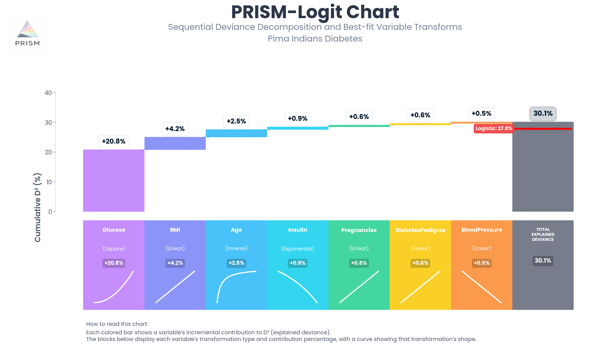

# PRISM-Logit

**Interpretable Sequential Logistic Regression with Automatic Transformation Discovery and Exact Deviance Attribution**

[](https://opensource.org/licenses/MIT)
[](https://www.python.org/downloads/)

PRISM-Logit extends [PRISM](https://github.com/gsymanowitz/prism-regression) (Progressive Refinement with Interpretable Sequential Modeling) to binary classification. It automatically discovers non-linear transformations of predictor variables under a Bernoulli-logit model while providing **exact pathwise deviance attribution** — a sequential decomposition showing how each variable contributes to explained deviance, in what order, and through what functional form.

## What Makes PRISM-Logit Different?

Standard logistic regression gives you coefficients. GAMs give you smooth curves. Tree ensembles give you predictions. **PRISM-Logit gives you a sequential explanatory narrative:**

```
Variable                Transform       ΔD²       Cumulative D²
─────────────────────────────────────────────────────────────────
Glucose                 Square         20.78%         20.78%
BMI                     Linear          4.24%         25.02%
Age                     Inverse         2.52%         27.54%
Insulin                 Exponential     0.90%         28.44%
Pregnancies             Linear          0.62%         29.06%
DiabetesPedigree        Linear          0.56%         29.62%
BloodPressure           Linear          0.50%         30.12%
Multivariate Refinement —               0.00%         30.12%
```

This tells you: glucose explains 20.8% of deviance with an **accelerating** (quadratic) relationship — diabetes risk rises sharply at higher glucose levels. BMI adds 4.2% linearly, age adds 2.5% with an **inverse** pattern (marginal risk highest for younger individuals, diminishing with seniority). The contributions sum exactly to total explained deviance. SkinThickness was automatically excluded (failed the significance threshold).

**No other classification method provides this.**

### The PRISM-Logit Chart

The signature PRISM-Logit chart visualises the sequential deviance decomposition as a waterfall, with each variable's transformation shape shown in the colored blocks. The red "Logistic" baseline line shows the standard logistic D², making the improvement from non-linear discovery immediately visible.



*Pima Indians Diabetes (n=768): Glucose (Square) dominates at 20.8% of explained deviance. PRISM-Logit achieves D²=30.1% vs standard logistic at 27.9% (+2.2pp from non-linear transformation discovery). AUC=0.822 on held-out test set.*

## Key Features

- **Automatic transformation discovery**: Tests 7 parametric forms (Linear, Logarithmic, Sqrt, Square, Cubic, Inverse, Exponential) per variable
- **Exact sequential D² decomposition**: Contributions sum exactly to total explained deviance (MR < 0.01% with default settings)
- **Classification-specific safeguards**:
  - *Linear-unless-proven-otherwise*: Non-linear transforms must significantly beat Linear (LRT, α=0.05)
  - *Categorical-aware restrictions*: Discrete predictors restricted to Linear transforms
  - *Ridge-stabilised refinement*: Prevents separation issues (λ=10⁻⁴)
- **Conservative interaction testing**: BIC with k×5 penalty — interactions must demonstrate strong evidence
- **Linear attribution mode**: Decomposes a standard logistic model when non-linear discovery isn't beneficial
- **Competitive performance**: Substantially outperforms logistic regression on large datasets; trails GAM by 0.5–1.8pp AUC and EBM by 0.7–3.3pp

## Installation

```bash
pip install numpy pandas scipy scikit-learn matplotlib
```

Then download `prism_logit.py` and import directly:

```python
from prism_logit import PRISMLogit, fit_prism_logit
```

### Dependencies

- Python ≥ 3.8
- numpy ≥ 1.21
- pandas ≥ 1.3
- scipy ≥ 1.7
- scikit-learn ≥ 1.0
- matplotlib ≥ 3.4

## Quick Start

```python
import pandas as pd
import matplotlib.pyplot as plt
from sklearn.model_selection import train_test_split
from prism_logit import PRISMLogit

# Load Pima Indians Diabetes dataset
url = "https://raw.githubusercontent.com/jbrownlee/Datasets/master/pima-indians-diabetes.data.csv"
columns = ['Pregnancies', 'Glucose', 'BloodPressure', 'SkinThickness',
           'Insulin', 'BMI', 'DiabetesPedigree', 'Age', 'Outcome']
df = pd.read_csv(url, names=columns)

X = df.drop(columns='Outcome').astype(float)
y = df['Outcome'].astype(float)

X_train, X_test, y_train, y_test = train_test_split(
    X, y, test_size=0.2, random_state=42, stratify=y)

# Fit model (all features are continuous — no categorical flag needed)
model = PRISMLogit(m=10)
model.fit(X_train, y_train, include_interactions=True)

# Predict and evaluate
probs = model.predict_proba(X_test)
metrics = model.evaluate(X_test, y_test)

# Get the sequential deviance attribution
attribution = model.get_deviance_attribution()
print(attribution)

# Generate the signature PRISM-Logit chart
fig = model.plot_prism_chart(dataset_name='Pima Indians Diabetes')
fig.savefig('prism_logit_diabetes.png', dpi=150, bbox_inches='tight')
plt.show()
```

## Detailed Usage

### Parameters

| Parameter | Default | Description |
|-----------|---------|-------------|
| `m` | 10 | Coordinate descent iterations per variable addition. Controls attribution quality. m=10 achieves MR < 0.01%. |
| `alpha` | 0.05 | Significance level for LRT stopping and linear-unless-proven-otherwise threshold. |
| `interaction_penalty` | 5.0 | BIC penalty multiplier for interactions (k×5). |
| `ridge_lambda` | 1e-4 | Ridge penalty on slopes for numerical stability. Set to 0 for exact logistic equivalence. |
| `max_iterations` | 200 | Maximum coordinate descent iterations in Step 3. |
| `convergence_tolerance` | 1e-8 | D² convergence criterion. |

### Categorical Variables

Flag any discrete, ordinal, or low-cardinality predictors as categorical. This restricts them to Linear transforms, preventing spurious curvature from fitting non-linear functions through a small number of discrete levels.

```python
model.fit(X_train, y_train,
          categorical=['sex', 'education', 'marital_status', 'occupation'])
```

### Linear Attribution Mode

When PRISM-Logit doesn't outperform logistic regression (typically on small datasets), use it as a **decomposition tool** for the logistic model:

```python
# Force all variables Linear, no interactions — decomposes the logistic model
model = PRISMLogit(m=10, ridge_lambda=0)  # lambda=0 for exact logistic match
model.fit(X_train, y_train,
          categorical=list(X.columns),  # all variables → Linear only
          include_interactions=False)

# The attribution table now decomposes the standard logistic model
attribution = model.get_deviance_attribution()
```

This provides the exact sequential D² decomposition of the logistic model under greedy ordering — something logistic regression itself cannot produce.

### Accessing Results

```python
# Step-by-step results
step1 = model.get_step1_results()      # univariate screening
step2 = model.get_step2_results()      # sequential selection
step3 = model.get_step3_results()      # convergence + MR
step4 = model.get_step4_results()      # interaction testing

# Attribution table
attr = model.get_deviance_attribution()

# Model parameters (for deployment)
params = model.get_model_parameters()
```

### Visualization

```python
fig = model.plot_results(X_train)
fig.savefig('prism_logit_results.png', dpi=150, bbox_inches='tight')
```

This produces:
- Log-odds contribution curves for each selected variable
- Deviance attribution bar chart

## How It Works

PRISM-Logit operates in two phases:

### Phase 1: Base Model Construction

1. **Step 1 — Screening**: Test all variables across applicable transforms via univariate logistic regression. Rank by D². Apply linear-unless-proven-otherwise threshold.

2. **Step 2 — Sequential Selection**: Greedy forward selection using likelihood-ratio tests (LRT). At each round:
   - Evaluate candidates via fast residual screening (Stage A) then exact LRT (Stage B)
   - Apply linear-unless-proven-otherwise check
   - Stop when no candidate exceeds the χ² critical value
   - Perform m iterations of coordinate descent for attribution quality

3. **Step 3 — Convergence**: Full cyclic coordinate descent until D² stabilises.

### Phase 2: Interaction Enhancement

4. **Step 4 — Interaction Testing**: Test all pairwise interactions against the converged base model using BIC with k×5 complexity penalty. Interactions use original (untransformed) variables.

### Transformation Library

| Transform | Formula | Captures |
|-----------|---------|----------|
| Linear | x | Baseline |
| Logarithmic | sign(x)·log(1+\|x\|) | Diminishing returns |
| Sqrt | sign(x)·√\|x\| | Mild concavity |
| Square | x² | Accelerating effects |
| Cubic | x³ | S-curves |
| Inverse | 1/(x+1) | Saturating effects |
| Exponential | exp(clip(x/σ, -10, 10)) | Explosive growth |

Note: Logarithmic and Sqrt use sign-preserving forms to handle negative values correctly.

## Empirical Performance

Results from repeated stratified validation across six benchmark datasets:

| Dataset | n | PRISM-Logit AUC | vs Logistic | vs GAM | vs EBM |
|---------|---|----------------|-------------|--------|--------|
| Bank Marketing | 41K | 0.932 | +0.001 | −0.011 | −0.019 |
| Adult Income | 30K | 0.895 | **+0.076** | −0.018 | −0.033 |
| Credit Card | 30K | 0.768 | **+0.048** | −0.005 | −0.014 |
| German Credit | 1K | 0.775 | −0.021 | +0.010 | −0.021 |
| Breast Cancer | 569 | 0.988 | −0.002 | +0.010 | −0.007 |
| Heart Disease | 297 | 0.874 | −0.027 | −0.031 | −0.029 |

**On large datasets**: PRISM-Logit substantially outperforms logistic regression (Adult Income: 20 wins in 20 splits) while providing exact deviance attribution unavailable from any comparison method.

**On small datasets**: PRISM-Logit typically defaults to linear forms and may trail logistic on AUC, but provides valuable sequential attribution through linear attribution mode.

## When to Use PRISM-Logit

**Use PRISM-Logit when you need:**
- A sequential narrative of what drives classification ("income explains 22%, then age adds 7%...")
- Explicit parametric functional forms for regulatory documentation
- Exact deviance decomposition for variable importance reporting
- An interpretable model that goes beyond linear logistic regression

**Consider alternatives when you need:**
- Maximum predictive accuracy (use EBM, GAM, or tree ensembles)
- Smooth non-parametric curves (use GAM)
- Very large p with automated feature selection (use LASSO/elastic net)
- Non-binary outcomes (PRISM-Logit currently supports binary classification only)

## Relationship to PRISM Regression

PRISM-Logit is the binary classification counterpart to [PRISM regression](https://github.com/gsymanowitz/prism-regression). Key differences:

| Aspect | PRISM Regression | PRISM-Logit |
|--------|-----------------|-------------|
| Response | Continuous | Binary (0/1) |
| Loss function | Squared error (R²) | Bernoulli deviance (D²) |
| Selection criterion | F-statistic | Likelihood ratio test |
| Attribution metric | Sequential R² | Sequential D² |
| Intercept | Per-variable intercepts | Single global intercept |
| Transform threshold | None | Linear-unless-proven-otherwise |
| Categorical handling | Standard | Restricted to Linear |
| Ridge penalty | None | λ=10⁻⁴ default |

## Citation

If you use PRISM-Logit in your research, please cite:

```bibtex
@article{symanowitz2026prismlogit,
  title={PRISM-Logit: Interpretable Sequential Logistic Regression with 
         Automatic Transformation Discovery and Exact Deviance Attribution},
  author={Symanowitz, Gavin},
  journal={arXiv preprint},
  year={2026}
}
```

And the parent method:

```bibtex
@article{symanowitz2026prism,
  title={PRISM: Progressive Refinement with Interpretable Sequential Modeling},
  author={Symanowitz, Gavin},
  journal={arXiv preprint},
  year={2026},
  note={stat.ME}
}
```

## License

MIT License. See [LICENSE](LICENSE) for details.

## Author

**Gavin Symanowitz**  
Independent Researcher  
gsymanowitz@gmail.com
